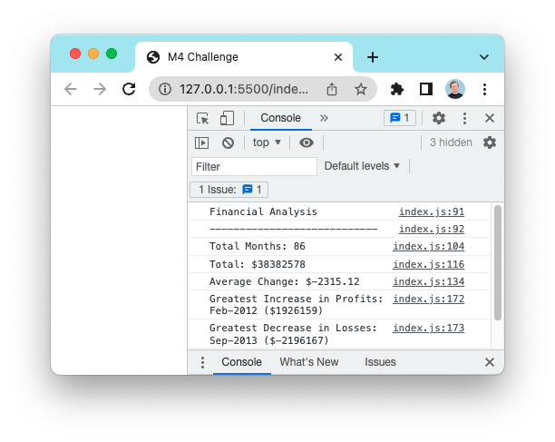

# Console Finances

This project is a financial analysis tool that calculates various statistics about a company's financial records. The user can input their own financial data in the `finances` array in the `index.js` file. The tool calculates the following statistics:

- The total number of months included in the dataset
- The net total amount of Profit/Losses over the entire period
- The average of the changes in Profit/Losses over the entire period
- The greatest increase in profits (date and amount) over the entire period
- The greatest decrease in losses (date and amount) over the entire period

## Running the code

To run the code and view the financial analysis, follow these steps:

1. Visit the [GitHub page](https://calummedlock.github.io/Console-Finances/) for this project.
2. Open the console in the browser.
   - On a PC: Press F12 or Ctrl+Shift+I.
   - On a Mac: Press Command+Option+I.
3. The financial analysis will be printed to the console.

## Credits

- [Number.prototype.toFixed() documentation](https://developer.mozilla.org/en-US/docs/Web/JavaScript/Reference/Global_Objects/Number/toFixed)

## License

This project is licensed under the MIT License. See the [LICENSE](LICENSE) file for details.

## Screenshot

